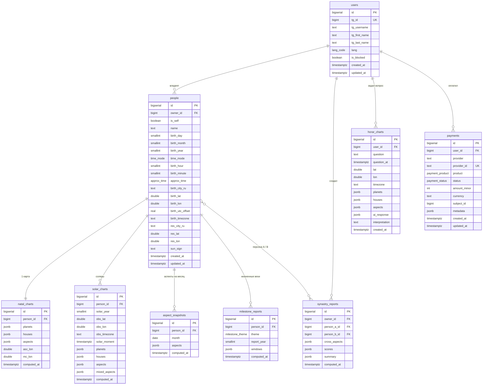

# AstroBot

Telegram Mini App — астрологический бот с натальными картами, синастрией, соляром, жизненными вехами, хораром и таро. Внутренняя валюта «звёзды» (✦) с оплатой через Telegram Stars и ЮKassa, реферальная программа.

---

## Стек

| Слой | Технология |
|---|---|
| Mini App (фронтенд) | React 18 (UMD) + Babel Standalone, Telegram WebApp SDK |
| Бот | grammY (Node.js / TypeScript), long polling (Railway) или вебхуки (если задан `WEBHOOK_URL`/`RENDER_EXTERNAL_URL`) |
| Бэкенд API | Fastify 4 (Node.js / TypeScript) + Zod |
| Расчёты | Astronomy Engine (в браузере) |
| Экспорт PDF | html2canvas + jsPDF (в браузере, ленивая загрузка) |
| Геокодинг | Open-Meteo Geocoding API (бесплатный, без ключа) |
| База данных | PostgreSQL (драйвер `pg`) |
| Платежи | **Telegram Stars (XTR) — реализовано**; ЮKassa (рубли) — каркас (активируется по ключам); внутренняя валюта «звёзды» (✦) |
| Инфраструктура (план) | VPS (РФ) |
| Инфраструктура (тест сейчас) | Бэкенд+бот+БД — Railway (US-West); фронтенд — GitHub Pages (`.nojekyll`, статика) |

> **Где сейчас выполняются расчёты.** Натальная карта, синастрия, соляр, вехи,
> аспекты месяца и **хорар** считаются **на стороне клиента** (Astronomy Engine в
> браузере Mini App). PDF натальной карты тоже собирается в браузере (html2canvas+jsPDF).
> Бэкенд выполняет CRUD (профили, согласия, настройки уведомлений, отметки просмотров),
> **экономику приложения** (баланс ✦, покупки возможностей, платежи Telegram Stars/ЮKassa,
> реферальные начисления — всё транзакционно и идемпотентно) и доставку сообщений через
> бота (уведомления, шэр PDF, чеки покупок). Chart-эндпойнты остаются заглушками (`501`),
> так как карты строятся у клиента. Это важно для нагрузки: тяжёлые вычисления вынесены на
> устройства пользователей и не нагружают сервер.

> **Монетизация (внутренняя валюта «звёзды» ✦).** Каждая возможность стоит N ✦
> (натал 5, синастрия 3/партнёр, соляр 3/год, вехи 5/тема, хорар 2, аспекты 2/месяц,
> карта дня 1, оракул да/нет 1). Новый пользователь получает 10 ✦. Списание — на сервере
> (ACID-транзакция + таблица `entitlements`: «куплено раз навсегда / за период / за партнёра»).
> Пополнение — за **Telegram Stars** (6 тарифов) и **рубли ЮKassa** (каркас). **Рефералка:**
> +5 ✦ пригласившему при первой покупке приглашённого.

### Реализованные услуги (фичи)

| Услуга | Где считается | Цена | Сохранение в БД |
|---|---|---|---|
| Натальная карта (своя) | браузер | 5 ✦ (раз навсегда) | профиль в `people`; право в `entitlements` |
| Натальная карта для другого человека | браузер | 5 ✦ (каждый раз) | **не сохраняется**; PDF уходит в Telegram (через бота, транзитом) |
| Синастрия | браузер | 3 ✦ / партнёр | партнёры в `people`; право на партнёра в `entitlements` |
| Соляр | браузер | 3 ✦ / год | профиль + город проживания; право на год в `entitlements` |
| Аспекты на месяц | браузер (курированные тексты `transits_*.json`) | 2 ✦ / (год+месяц) | право в `entitlements`; отметки просмотра (`aspect_views`) |
| Жизненные вехи | браузер | 5 ✦ / тема (до текущего лимита; тело/здоровье — бесплатно) | право с оплаченным лимитом лет в `entitlements` |
| Хорар (точечные вопросы) | браузер (`horar-engine.js`) | 2 ✦ / вопрос | localStorage-кулдаун; **не сохраняется** |
| Таро: карта дня | браузер (`tarot-*.js`) | 1 ✦ / день | право на дату в `entitlements` |
| Таро: оракул «да/нет» | браузер | 1 ✦ / вопрос | — |
| Уведомления (соляр/аспекты/карта дня/вехи) | планировщик в боте | — | настройки + журнал (`notify_*`, `*_views`, `notifications_sent`) |
| Пополнение баланса | Telegram Stars / ЮKassa | — | `star_purchases` / `ruble_purchases` (идемпотентно), `users.balance` |
| Рефералы | — | +5 ✦ | `users.referred_by`, `users.referral_rewarded` |
| Обратная связь (идея/баг) | — | — | `feedback` (+ DM админу через бота) |

---

## Архитектура

### Схема компонентов

```
┌──────────────────────────────────────────────────────────────────────┐
│                            ПОЛЬЗОВАТЕЛЬ (Telegram)                      │
└───────────────┬───────────────────────────────────┬───────────────────┘
                │ /start                             │ открывает Mini App
                ▼                                     ▼
   ┌─────────────────────────┐         ┌──────────────────────────────────┐
   │  grammY-бот (long poll)  │         │  Mini App (GitHub Pages, статика) │
   │  • /start → кнопка app   │         │  • онбординг (имя/дата/время/город│
   │  • upsert user, проверка │         │    + согласие)                    │
   │    наличия профиля       │         │  • расчёты карт в браузере        │
   └───────────┬─────────────┘         │    (Astronomy Engine)             │
               │                        │  • Telegram initData (auth)       │
               │ один процесс           └───────────────┬──────────────────┘
               ▼                                         │ HTTPS + Authorization: tma
   ┌──────────────────────────────────────────────┐     │
   │       Бэкенд: Fastify API (Node.js)           │◄────┘
   │  ┌────────────┬──────────────┬─────────────┐  │
   │  │ routes/    │ plugins/auth │ db/queries/  │  │
   │  │ users      │ • initData   │ users        │  │
   │  │ people     │   HMAC       │ people       │  │
   │  │ charts(501)│ • Bot-Secret │ consents     │  │
   │  │ admin(dev) │ • ownership  │              │  │
   │  └────────────┴──────────────┴─────────────┘  │
   │            бот и API — в одном процессе         │
   └───────────────────────┬─────────────────────────┘
                            │ pg.Pool (internal network)
                            ▼
                 ┌────────────────────────┐
                 │   PostgreSQL            │
                 │  users, people,         │
                 │  legal_consents,        │
                 │  *_charts (кэш)…        │
                 └────────────────────────┘

   Внешние сервисы:
   • Open-Meteo Geocoding (город → координаты + таймзона) — вызывается из браузера
```

### Внутренние компоненты бэкенда

| Компонент | Файл | Назначение |
|---|---|---|
| Точка входа | `src/index.ts` | Поднимает Fastify, бота (вебхук или long polling) и планировщик уведомлений в том же процессе, graceful shutdown |
| Сборка приложения | `src/app.ts` | Регистрация плагинов (CORS, sensible, auth) и роутов; вебхук-роут если задан публичный URL |
| Бот | `src/bot/bot.ts` | grammY: `/start` → кнопка Main App; `/id`, `/me`, `/broadcast` (админ); **платежи**: `pre_checkout_query` + `successful_payment` (начисление ✦, идемпотентно); режимы long polling / webhook |
| Планировщик | `src/bot/scheduler.ts` | Раз в 12 ч: уведомления о соляре/аспектах/**карте дня**/сдвиге горизонта вех (антидубль через `notifications_sent`) |
| Платежи | `src/payments.ts`, `src/yookassa.ts`, `src/db/queries/payments.ts` | Тарифы (Stars/рубли), клиент ЮKassa, транзакционное+идемпотентное начисление ✦, реферальная награда |
| Аутентификация | `src/plugins/auth.ts` | Проверка Telegram initData (HMAC, **константное сравнение**), Bot-Secret, dev-bypass; helpers `ownsAccount`/`requireOwner` (защита от IDOR) |
| Роуты | `src/routes/*.ts` | `users` (вкл. баланс/покупки/платежи/рефералы), `people`, `charts` (501), `notifications`, `share` (PDF), `feedback`, `yookassa` (вебхук), `admin` (dev) |
| Доступ к БД | `src/db/queries/*.ts` | `users`, `people`, `consents`, `notifications`, `entitlements`, `payments`, `feedback`, `settings` — параметризованные запросы |
| Конфиг | `src/config.ts` | Типизированные env: `db`, `tg` (bot token/secret), `yookassa`, `adminIds`, `miniAppUrl`, `webhookUrl` |

### Поток данных «онбординг»

1. Пользователь жмёт `/start` → бот делает `upsertUser`, проверяет `getSelfPerson`.
2. Нет профиля → бот шлёт кнопку «Заполнить данные» (open Mini App).
3. Mini App при загрузке вызывает `GET /users/:tgId/self`. Если `404` — показывает форму онбординга.
4. Пользователь заполняет форму + ставит галочку согласия → `POST /users/:tgId/self` + `POST /users/:tgId/consents` (×2).
5. Дальше профиль читается из БД; карты строятся в браузере по этим данным.

---

## База данных

### Схема файлов

```
db/
├── migrations/
│   └── 001_initial_schema.sql   # базовая схема: таблицы, индексы, триггеры
├── scripts/                     # инкрементальные миграции (применять по порядку)
│   ├── 002_review_fixes.sql        # legal_consents.tg_id + SET NULL; birth_year 1900–2100
│   ├── 003_notifications.sql       # notify_*, solar_views, aspect_views, notifications_sent
│   ├── 004_drop_onboarding_draft.sql # удаление наследия бота-диалога
│   ├── 005_milestones_horizon.sql  # app_settings; kind += 'milestones'
│   ├── 006_feedback.sql            # таблица feedback
│   ├── 007_balance.sql             # users.balance (валюта ✦, старт 10)
│   ├── 008_entitlements.sql        # покупки возможностей за ✦
│   ├── 009_star_purchases.sql      # оплата Telegram Stars (идемпотентность по charge_id)
│   ├── 010_ruble_purchases.sql     # оплата ЮKassa (идемпотентность по payment_id)
│   ├── 011_referrals.sql           # users.referred_by, referral_rewarded
│   └── 012_notify_daily.sql        # users.notify_daily; kind += 'daily'
└── seeds/
    └── 001_dev_seed.sql         # тестовые данные для разработки
```

> Скрипты `002–012` применяются вручную к живой БД (`psql "$DATABASE_URL" -f db/scripts/NNN_*.sql`
> или Railway → Postgres → Console). Бэкенд их автоматически **не** накатывает.

### ENUM-типы

| Тип | Значения | Назначение |
|---|---|---|
| `lang_code` | `ru`, `en` | Язык интерфейса пользователя |
| `time_mode` | `exact`, `approx`, `unknown` | Точность времени рождения |
| `approx_time` | `morning`, `day`, `evening`, `night` | Приблизительное время суток рождения |
| `milestone_theme` | `marriage`, `divorce`, `child`, `career`, `relocation`, `health`, `surgery`, `travel`, `change`, `key` | Тематика жизненной вехи |
| `payment_status` | `pending`, `succeeded`, `cancelled`, `refunded` | Статус платежа |
| `payment_product` | `natal_full`, `synastry`, `solar`, `milestones`, `horar`, `subscription` | Платный продукт |

---

### Таблицы

#### `users` — Пользователи

Хранит всех пользователей, запустивших бота в Telegram. Запись создаётся при первом обращении к боту.

| Столбец | Тип | NULL | По умолчанию | Ограничения | Описание |
|---|---|---|---|---|---|
| `id` | `BIGSERIAL` | NO | auto | PRIMARY KEY | Внутренний идентификатор |
| `tg_id` | `BIGINT` | NO | — | UNIQUE | Telegram user ID (неизменяемый, выдаётся Telegram) |
| `tg_username` | `TEXT` | YES | — | — | Юзернейм в Telegram (`@username`), может меняться или отсутствовать |
| `tg_first_name` | `TEXT` | YES | — | — | Имя в Telegram |
| `tg_last_name` | `TEXT` | YES | — | — | Фамилия в Telegram |
| `lang` | `lang_code` | NO | `'ru'` | IN (`ru`, `en`) | Язык интерфейса |
| `is_blocked` | `BOOLEAN` | NO | `false` | — | Пользователь заблокировал бота; при `true` бот не отправляет сообщения |
| `onboarding_step` | `TEXT` | YES | — | IN (`name`,`birth_date`,`birth_time`,`city`,`consent`,`done`) | Шаг онбординга; ставится в `'done'` при создании self-профиля |
| `onboarding_completed` | `BOOLEAN` | NO | `false` | — | `true` после создания self-профиля (онбординг в Mini App завершён) |
| `notify_solar` | `BOOLEAN` | NO | `false` | — | Слать уведомление о приближении нового солярного года |
| `notify_aspects` | `BOOLEAN` | NO | `false` | — | Слать уведомление о наступлении нового месяца аспектов |
| `notify_daily` | `BOOLEAN` | NO | `false` | — | Слать уведомление о новой карте дня *(мигр. 012)* |
| `notify_viewed` | `BOOLEAN` | NO | `false` | — | Слать уведомления даже о уже просмотренных годах/месяцах |
| `balance` | `INTEGER` | NO | `10` | — | Баланс внутренней валюты «звёзды» ✦ (старт 10) *(мигр. 007)* |
| `referred_by` | `TEXT` | YES | — | — | `tg_id` пригласившего (ставится один раз) *(мигр. 011)* |
| `referral_rewarded` | `BOOLEAN` | NO | `false` | — | Награда пригласившему уже выдана (при первой покупке приглашённого) *(мигр. 011)* |
| `created_at` | `TIMESTAMPTZ` | NO | `now()` | — | Дата первого запуска |
| `updated_at` | `TIMESTAMPTZ` | NO | `now()` | auto-trigger | Дата последнего обновления записи |

**Онбординг-сценарий (шаги):** `name` → `birth_date` → `birth_time` → `city` → `consent` → `done`

**Не может принимать:** `tg_id ≤ 0`, дублирующийся `tg_id`, `lang` вне (`ru`, `en`), `onboarding_step` вне списка значений.

---

#### `people` — Профили рождения

Один пользователь может иметь несколько профилей: **себя** (`is_self = true`, всегда один) и **партнёров** для синастрии (любое количество). Все астрологические расчёты привязаны к записи в этой таблице, а не к пользователю напрямую.

| Столбец | Тип | NULL | По умолчанию | Ограничения | Описание |
|---|---|---|---|---|---|
| `id` | `BIGSERIAL` | NO | auto | PRIMARY KEY | Внутренний идентификатор |
| `owner_id` | `BIGINT` | NO | — | FK → `users.id` CASCADE | Владелец профиля |
| `is_self` | `BOOLEAN` | NO | `false` | UNIQUE (owner_id, is_self=true) | `true` = профиль самого пользователя |
| `name` | `TEXT` | NO | — | — | Имя (на русском) |
| `name_en` | `TEXT` | YES | — | — | Имя (транслитерация) |
| `birth_day` | `SMALLINT` | NO | — | 1–31 | День рождения |
| `birth_month` | `SMALLINT` | NO | — | 1–12 | Месяц рождения |
| `birth_year` | `SMALLINT` | NO | — | 1900–2025 | Год рождения |
| `time_mode` | `time_mode` | NO | `'unknown'` | ENUM | Режим точности времени рождения |
| `birth_hour` | `SMALLINT` | YES | — | 0–23; обязателен если `time_mode='exact'` | Час рождения |
| `birth_minute` | `SMALLINT` | YES | — | 0–59; обязателен если `time_mode='exact'` | Минута рождения |
| `approx_time` | `approx_time` | YES | — | ENUM; обязателен если `time_mode='approx'` | Часть суток рождения |
| `birth_city_ru` | `TEXT` | YES | — | — | Название города рождения (рус.) |
| `birth_city_en` | `TEXT` | YES | — | — | Название города рождения (англ.) |
| `birth_city_reg` | `TEXT` | YES | — | — | Регион / страна |
| `birth_lat` | `DOUBLE PRECISION` | NO | — | -90 – +90 | Широта места рождения |
| `birth_lon` | `DOUBLE PRECISION` | NO | — | -180 – +180 | Долгота места рождения |
| `birth_utc_offset` | `REAL` | NO | — | -12 – +14 | UTC-смещение в момент рождения (дробное: +5.5 для Индии) |
| `birth_timezone` | `TEXT` | NO | — | — | IANA-таймзона места рождения (`Europe/Moscow`) |
| `res_city_ru` | `TEXT` | YES | — | — | Город проживания сейчас (рус.) — для соляра |
| `res_city_en` | `TEXT` | YES | — | — | Город проживания сейчас (англ.) |
| `res_lat` | `DOUBLE PRECISION` | YES | — | -90 – +90 | Широта места проживания |
| `res_lon` | `DOUBLE PRECISION` | YES | — | -180 – +180 | Долгота места проживания |
| `res_timezone` | `TEXT` | YES | — | — | IANA-таймзона места проживания |
| `sun_sign` | `TEXT` | YES | — | — | Знак Солнца (`leo`, `aries` и т.д.), кэшируется при сохранении |
| `birth_date_changed_at` | `TIMESTAMPTZ` | YES | `null` | — | Момент первой смены даты рождения; `null` — не меняли. Если `NOT NULL` и `is_self=true` — повторная смена запрещена |
| `created_at` | `TIMESTAMPTZ` | NO | `now()` | — | Дата создания профиля |
| `updated_at` | `TIMESTAMPTZ` | NO | `now()` | auto-trigger | Дата последнего изменения |

**Бизнес-правила:**

| Поле | Кто может менять | Сколько раз |
|---|---|---|
| `name` | Сам пользователь | Без ограничений |
| `time_mode`, `birth_hour`, `birth_minute`, `approx_time` | Сам пользователь | Без ограничений |
| `birth_day/month/year` | Сам пользователь (только `is_self=true`) | **Один раз за всё время** (защита от переиспользования натальной карты) |
| Любые поля | Партнёрские профили (`is_self=false`) | Без ограничений |

**Составные ограничения:**

| Constraint | Правило |
|---|---|
| `uq_one_self_per_user` | Partial unique index на `owner_id WHERE is_self=true` — у одного пользователя ровно один профиль «себя», партнёров без ограничений |
| `chk_exact_time` | Если `time_mode='exact'` → `birth_hour IS NOT NULL AND birth_minute IS NOT NULL` |
| `chk_approx_time` | Если `time_mode='approx'` → `approx_time IS NOT NULL` |

**Не может принимать:** `birth_day > 31`, `birth_month > 12`, `birth_year < 1900`, `birth_lat > 90`, `birth_lon > 180`, `birth_utc_offset > 14`, `time_mode='exact'` без `birth_hour`/`birth_minute`.

**Триггер `trg_invalidate_cache_on_birth_change`:**
- При изменении birth-полей → удаляет `natal_charts`, `synastry_reports`, `aspect_snapshots`, `milestone_reports`
- При изменении `res_lat`/`res_lon` → удаляет только `solar_charts` (место жительства влияет только на соляр)

---

#### `legal_consents` — Юридические согласия

Хранит факт принятия каждого юридического документа каждым пользователем. Запись создаётся при онбординге (галочка согласия в Mini App). Повторное принятие той же версии идемпотентно. **Согласия хранятся вечно:** при удалении пользователя `user_id` обнуляется (`SET NULL`), но запись и снимок `tg_id` остаются — для юридического аудита.

| Столбец | Тип | NULL | По умолчанию | Ограничения | Описание |
|---|---|---|---|---|---|
| `id` | `BIGSERIAL` | NO | auto | PRIMARY KEY | — |
| `user_id` | `BIGINT` | YES | — | FK → `users.id` **SET NULL** | Пользователь (NULL после его удаления) |
| `tg_id` | `BIGINT` | NO | — | — | Снимок Telegram ID на момент согласия (переживает удаление) |
| `document_type` | `TEXT` | NO | — | IN (`privacy_policy`, `terms_of_service`) | Тип документа |
| `document_version` | `TEXT` | NO | — | — | Версия документа (`'1.0'`, `'2025-06'`) |
| `accepted_at` | `TIMESTAMPTZ` | NO | `now()` | — | Момент принятия |
| `tg_client` | `TEXT` | YES | — | — | Telegram-клиент (из initData / `'miniapp'`) |
| `ip_address` | `INET` | YES | — | — | IP запроса (через Mini App — реальный IP пользователя) |

**Составное уникальное ограничение:** `(user_id, document_type, document_version)` — нельзя принять одну версию дважды.

**Не может принимать:** `document_type` вне (`privacy_policy`, `terms_of_service`), пустой `document_version`.

---

#### `solar_views`, `aspect_views` — Отметки просмотров (для уведомлений)

Фиксируют, какие солярные годы / месяцы аспектов пользователь уже открывал — чтобы не присылать уведомление о том, что он уже видел (если `notify_viewed=false`).

| Таблица | Ключ | Поля |
|---|---|---|
| `solar_views` | `(user_id, solar_year)` | `user_id` FK→users CASCADE, `solar_year SMALLINT`, `viewed_at` |
| `aspect_views` | `(user_id, view_year, view_month)` | `user_id` FK→users CASCADE, `view_year SMALLINT`, `view_month SMALLINT` (1–12), `viewed_at` |

#### `notifications_sent` — Журнал отправленных уведомлений (антидубль)

Гарантирует, что одно и то же уведомление не уйдёт дважды.

| Столбец | Тип | Описание |
|---|---|---|
| `user_id` | `BIGINT` FK→users CASCADE | Получатель |
| `kind` | `TEXT` IN (`solar`,`aspects`,`milestones`,`daily`) | Тип уведомления *(мигр. 005, 012)* |
| `ref` | `TEXT` | Год соляра (`'2027'`), месяц аспектов (`'2026-07'`), горизонт вех (`'2043'`) или дата карты дня (`'2026-07-01'`) |
| `sent_at` | `TIMESTAMPTZ` | Когда отправлено |

PRIMARY KEY `(user_id, kind, ref)`.

---

### Экономика приложения (используются кодом)

#### `entitlements` — Купленные возможности *(мигр. 008)*

Что пользователь уже оплатил валютой ✦. Логика «куплено раз навсегда / за период / за партнёра».

| Столбец | Тип | Описание |
|---|---|---|
| `id` | `BIGSERIAL` PK | — |
| `user_id` | `BIGINT` FK→users CASCADE | Владелец права |
| `feature` | `TEXT` | `natal_self`, `aspects`, `solar`, `synastry`, `milestones`, `daily` |
| `item_key` | `TEXT` DEFAULT `''` | Ключ единицы: `''` (натал), `'YYYY-MM'` (аспекты), `'YYYY'` (соляр), id партнёра, id темы, `'YYYY-MM-DD'` (карта дня) |
| `paid_limit` | `INTEGER` NULL | Для `milestones` — год-лимит, до которого тема оплачена |
| `created_at` | `TIMESTAMPTZ` | — |

**Уникально:** `(user_id, feature, item_key)`. Возможности «каждый раз» (`natal_other`, `oracle`, `horary`) прав **не** пишут — списываются при каждом действии.

#### `star_purchases` — Пополнения за Telegram Stars *(мигр. 009)*

| Столбец | Тип | Описание |
|---|---|---|
| `id` | `BIGSERIAL` PK | — |
| `user_id` | `BIGINT` FK→users SET NULL | Плательщик |
| `tg_id` | `BIGINT` | Снимок |
| `charge_id` | `TEXT` **UNIQUE** | `telegram_payment_charge_id` — идемпотентность (повторный вебхук не начислит дважды) |
| `tariff` | `TEXT` | id тарифа |
| `vz` | `INTEGER` | Начислено ✦ |
| `stars` | `INTEGER` | Уплачено Telegram Stars (XTR) |
| `created_at` | `TIMESTAMPTZ` | — |

#### `ruble_purchases` — Пополнения за рубли (ЮKassa) *(мигр. 010)*

Аналог `star_purchases`, идемпотентность по `payment_id` **UNIQUE** (id платежа ЮKassa); поле `rub` вместо `stars`.

#### `feedback` — Обратная связь *(мигр. 006)*

| Столбец | Тип | Описание |
|---|---|---|
| `id` | `BIGSERIAL` PK | — |
| `user_id` | `BIGINT` FK→users SET NULL | Автор |
| `tg_id` | `BIGINT` | Снимок |
| `kind` | `TEXT` IN (`idea`,`bug`) | Тип обращения |
| `message` | `TEXT` | Текст |
| `has_screenshot` | `BOOLEAN` DEFAULT `false` | Был ли скриншот (сам файл не хранится — уходит админу в DM) |
| `created_at` | `TIMESTAMPTZ` | — |

#### `app_settings` — Настройки приложения (key/value) *(мигр. 005)*

`key` PK, `value TEXT`, `updated_at`. Сейчас хранит `milestones_horizon` — текущий ступенчатый горизонт «Жизненных вех» (для разовой рассылки при его сдвиге).

---

> ### ⚠️ Зарезервированные таблицы (пока не используются кодом)
>
> Следующие таблицы есть в схеме как **задел на будущее** (серверный кэш карт),
> но текущий код их **не читает и не пишет** — карты считаются в браузере. Их
> триггеры инвалидации кэша по факту no-op. К удалению **не обязательны**.
>
> `natal_charts`, `solar_charts`, `synastry_reports`, `aspect_snapshots`,
> `milestone_reports`, `horar_charts`, `payments`.
>
> **`payments`** (из 001) — **устарела**: реальные платежи ведутся в новых таблицах
> `star_purchases` / `ruble_purchases` (идемпотентных, с транзакционным начислением ✦).
> ENUM `payment_status` / `payment_product` тоже относятся к неиспользуемой `payments`.

#### `natal_charts` — Натальная карта (кэш) *(зарезервировано)*

Кэш результата расчёта натальной карты для профиля. Одна запись на профиль. Пересчитывается автоматически при изменении данных рождения (через триггер на `people`). Хранит данные в JSONB, так как структура планет и аспектов нефиксированна.

| Столбец | Тип | NULL | По умолчанию | Ограничения | Описание |
|---|---|---|---|---|---|
| `id` | `BIGSERIAL` | NO | auto | PRIMARY KEY | — |
| `person_id` | `BIGINT` | NO | — | FK → `people.id` CASCADE, UNIQUE | Профиль рождения |
| `planets` | `JSONB` | NO | — | — | Позиции планет: `{ sun: { lon, sign_idx, house, retrograde }, moon: {...}, ... }` |
| `houses` | `JSONB` | YES | — | — | Куспиды домов: `{ "1": lon, "2": lon, ... }` — `null` если `time_mode='unknown'` |
| `aspects` | `JSONB` | NO | — | — | Аспекты между планетами: `[{ p1, p2, type, angle, orb, applying }]` |
| `asc_lon` | `DOUBLE PRECISION` | YES | — | — | Эклиптическая долгота Асцендента — `null` если время неизвестно |
| `mc_lon` | `DOUBLE PRECISION` | YES | — | — | Эклиптическая долгота МС — `null` если время неизвестно |
| `computed_at` | `TIMESTAMPTZ` | NO | `now()` | — | Момент расчёта |

**Не может принимать:** два ряда с одним `person_id` (UNIQUE).

---

#### `solar_charts` — Соляр (кэш)

Кэш расчёта солярной (юбилейной) карты. Создаётся для каждой комбинации **профиль + год + место наблюдения**, потому что место проживания в момент соляра влияет на расчёт. Смешанные аспекты между соляром и натальной картой хранятся отдельно в `mixed_aspects`.

| Столбец | Тип | NULL | По умолчанию | Ограничения | Описание |
|---|---|---|---|---|---|
| `id` | `BIGSERIAL` | NO | auto | PRIMARY KEY | — |
| `person_id` | `BIGINT` | NO | — | FK → `people.id` CASCADE | Профиль рождения |
| `solar_year` | `SMALLINT` | NO | — | — | Год соляра (год возврата Солнца) |
| `obs_lat` | `DOUBLE PRECISION` | NO | — | — | Широта места наблюдения |
| `obs_lon` | `DOUBLE PRECISION` | NO | — | — | Долгота места наблюдения |
| `obs_city_ru` | `TEXT` | YES | — | — | Название города наблюдения (рус.) |
| `obs_city_en` | `TEXT` | YES | — | — | Название города наблюдения (англ.) |
| `obs_timezone` | `TEXT` | NO | — | — | IANA-таймзона места наблюдения |
| `solar_moment` | `TIMESTAMPTZ` | NO | — | — | Точный момент возврата Солнца (UTC) |
| `planets` | `JSONB` | NO | — | — | Позиции планет солярной карты |
| `houses` | `JSONB` | YES | — | — | Куспиды домов соляра |
| `aspects` | `JSONB` | NO | — | — | Аспекты внутри солярной карты |
| `asc_lon` | `DOUBLE PRECISION` | YES | — | — | Асцендент соляра |
| `mc_lon` | `DOUBLE PRECISION` | YES | — | — | МС соляра |
| `mixed_aspects` | `JSONB` | YES | — | — | Аспекты «планеты соляра → планеты натала» |
| `computed_at` | `TIMESTAMPTZ` | NO | `now()` | — | Момент расчёта |

**Составное уникальное ограничение:** `(person_id, solar_year, obs_lat, obs_lon)` — не может быть двух одинаковых расчётов для одной точки.

---

#### `synastry_reports` — Синастрия (кэш)

Кэш расчёта совместимости двух профилей. Кросс-аспекты (аспекты между планетами персоны A и персоны B) и итоговые баллы по четырём измерениям хранятся в JSONB.

| Столбец | Тип | NULL | По умолчанию | Ограничения | Описание |
|---|---|---|---|---|---|
| `id` | `BIGSERIAL` | NO | auto | PRIMARY KEY | — |
| `owner_id` | `BIGINT` | NO | — | FK → `users.id` CASCADE | Пользователь, создавший отчёт |
| `person_a_id` | `BIGINT` | NO | — | FK → `people.id` CASCADE | Персона A |
| `person_b_id` | `BIGINT` | NO | — | FK → `people.id` CASCADE | Персона B |
| `cross_aspects` | `JSONB` | NO | — | — | Кросс-аспекты: `[{ pa, pb, type, angle, orb, domain, tone }]` |
| `scores` | `JSONB` | NO | — | — | Баллы: `{ total, attraction, emotion, communication, stability }` |
| `summary` | `JSONB` | YES | — | — | Итог: `{ theme, positive_count, tension_count }` |
| `computed_at` | `TIMESTAMPTZ` | NO | `now()` | — | Момент расчёта |

**Ограничения:**

| Constraint | Правило |
|---|---|
| `uq_synastry_pair` | `(person_a_id, person_b_id)` уникальны — нельзя дважды сохранить одну пару |
| `chk_synastry_different` | `person_a_id <> person_b_id` — нельзя сравнивать профиль сам с собой |

**Не может принимать:** `person_a_id = person_b_id`, дублирующуюся пару.

---

#### `aspect_snapshots` — Аспекты на месяц (кэш)

Кэш транзитных аспектов для профиля на конкретный месяц. Используется в разделе «Аспекты на месяц» главного экрана.

| Столбец | Тип | NULL | По умолчанию | Ограничения | Описание |
|---|---|---|---|---|---|
| `id` | `BIGSERIAL` | NO | auto | PRIMARY KEY | — |
| `person_id` | `BIGINT` | NO | — | FK → `people.id` CASCADE | Профиль рождения |
| `month` | `DATE` | NO | — | `DAY = 1`; UNIQUE с `person_id` | Первый день месяца (`2025-07-01`) |
| `aspects` | `JSONB` | NO | — | — | Список аспектов: `[{ planet, transit_planet, type, date_start, date_exact, date_end, interpretation_key }]` |
| `computed_at` | `TIMESTAMPTZ` | NO | `now()` | — | Момент расчёта |

**Не может принимать:** `month` с `DAY ≠ 1` (например `2025-07-15`), дублирующуюся пару `(person_id, month)`.

---

#### `milestone_reports` — Жизненные вехи (кэш)

Кэш расчёта жизненных окон по конкретной теме и году. Тема определяет, какие планеты и куспиды анализируются (сигнификаторы). Окна рассчитываются как периоды активных транзитов медленных планет к сигнификаторам темы.

| Столбец | Тип | NULL | По умолчанию | Ограничения | Описание |
|---|---|---|---|---|---|
| `id` | `BIGSERIAL` | NO | auto | PRIMARY KEY | — |
| `person_id` | `BIGINT` | NO | — | FK → `people.id` CASCADE | Профиль рождения |
| `theme` | `milestone_theme` | NO | — | ENUM | Тема вехи |
| `report_year` | `SMALLINT` | NO | — | — | Год, для которого строился отчёт |
| `windows` | `JSONB` | NO | — | — | Окна событий: `[{ start, end, score, polarity, bucket, aspects: [{ transiter, target, type, sym }], tone: { label, color } }]` |
| `computed_at` | `TIMESTAMPTZ` | NO | `now()` | — | Момент расчёта |

**Составное уникальное ограничение:** `(person_id, theme, report_year)` — одна запись на тему + год.

---

#### `horar_charts` — Хорарные карты *(позже)*

Карта момента задачи вопроса пользователем. Для хорарной астрологии важна точная дата, время и место формулировки вопроса. Интерпретация генерируется ИИ.

| Столбец | Тип | NULL | По умолчанию | Ограничения | Описание |
|---|---|---|---|---|---|
| `id` | `BIGSERIAL` | NO | auto | PRIMARY KEY | — |
| `user_id` | `BIGINT` | NO | — | FK → `users.id` CASCADE | Пользователь |
| `question` | `TEXT` | NO | — | — | Текст вопроса |
| `question_at` | `TIMESTAMPTZ` | NO | — | — | Момент вопроса (UTC) |
| `lat` | `DOUBLE PRECISION` | NO | — | — | Широта места вопроса |
| `lon` | `DOUBLE PRECISION` | NO | — | — | Долгота места вопроса |
| `timezone` | `TEXT` | NO | — | — | IANA-таймзона места вопроса |
| `city_name` | `TEXT` | YES | — | — | Название города вопроса |
| `planets` | `JSONB` | YES | — | — | Позиции планет хорарной карты |
| `houses` | `JSONB` | YES | — | — | Куспиды домов хорарной карты |
| `aspects` | `JSONB` | YES | — | — | Аспекты хорарной карты |
| `ai_response` | `JSONB` | YES | — | — | Сырой ответ ИИ (для аудита и переинтерпретации) |
| `interpretation` | `TEXT` | YES | — | — | Итоговый текст интерпретации |
| `created_at` | `TIMESTAMPTZ` | NO | `now()` | — | Дата сохранения |

---

#### `payments` — Платежи *(позже)*

Все платёжные транзакции. Поддерживает два провайдера: ЮКасса (рубли) и Telegram Stars. Сумма хранится в минимальных единицах: копейках для рублей, целых звёздах для XTR. При удалении пользователя платежи не удаляются (`ON DELETE RESTRICT`) — это требование финансового учёта.

| Столбец | Тип | NULL | По умолчанию | Ограничения | Описание |
|---|---|---|---|---|---|
| `id` | `BIGSERIAL` | NO | auto | PRIMARY KEY | — |
| `user_id` | `BIGINT` | NO | — | FK → `users.id` **RESTRICT** | Плательщик |
| `provider` | `TEXT` | NO | `'yookassa'` | — | Провайдер: `yookassa` или `telegram_stars` |
| `provider_id` | `TEXT` | YES | — | UNIQUE | ID транзакции у провайдера |
| `product` | `payment_product` | NO | — | ENUM | Оплаченный продукт |
| `status` | `payment_status` | NO | `'pending'` | ENUM | Статус платежа |
| `amount_minor` | `INT` | NO | — | `> 0` | Сумма в минимальных единицах (копейки / звёзды) |
| `currency` | `TEXT` | NO | `'RUB'` | — | Валюта: `RUB` или `XTR` (Telegram Stars) |
| `subject_id` | `BIGINT` | YES | — | — | ID связанного объекта (например, `people.id`) |
| `metadata` | `JSONB` | YES | — | — | Дополнительные данные от провайдера |
| `created_at` | `TIMESTAMPTZ` | NO | `now()` | — | Дата создания транзакции |
| `updated_at` | `TIMESTAMPTZ` | NO | `now()` | auto-trigger | Дата последнего изменения статуса |

**Не может принимать:** `amount_minor ≤ 0`, `status` вне ENUM, `product` вне ENUM.

---

### ER-диаграмма



> Диаграмма показывает базовую схему (001) и кэш-таблицы. Таблицы экономики и сервиса —
> `entitlements`, `star_purchases`, `ruble_purchases`, `feedback` (все FK → `users`),
> `app_settings` (без FK), а также колонки `users.balance/referred_by/referral_rewarded/notify_daily`
> — добавлены миграциями `005–012` и здесь не отрисованы.

---

### Индексы

| Индекс | Таблица | Столбцы | Тип | Причина |
|---|---|---|---|---|
| `idx_users_tg_id` | `users` | `tg_id` | B-tree | Поиск пользователя по Telegram ID при каждом сообщении боту |
| `idx_people_owner` | `people` | `owner_id` | B-tree | Получение всех профилей пользователя |
| `idx_people_owner_self` | `people` | `owner_id` WHERE `is_self=true` | Partial | Быстрый доступ к «своему» профилю |
| `idx_natal_person` | `natal_charts` | `person_id` | B-tree | Проверка наличия кэша натала |
| `idx_solar_person_year` | `solar_charts` | `(person_id, solar_year)` | B-tree | Поиск соляра для профиля и года |
| `idx_synastry_owner` | `synastry_reports` | `owner_id` | B-tree | Список синастрий пользователя |
| `idx_synastry_a` / `_b` | `synastry_reports` | `person_a_id`, `person_b_id` | B-tree | Инвалидация кэша при изменении профиля |
| `idx_aspects_person_month` | `aspect_snapshots` | `(person_id, month)` | B-tree | Проверка наличия снимка на конкретный месяц |
| `idx_milestones_person` | `milestone_reports` | `person_id` | B-tree | Список отчётов по вехам |
| `idx_horar_user` | `horar_charts` | `user_id` | B-tree | История хораров пользователя |
| `idx_payments_user` | `payments` | `user_id` | B-tree | История платежей |
| `idx_payments_status` | `payments` | `status` WHERE `='pending'` | Partial | Обработка незавершённых платежей |

---

### Триггеры

| Триггер | Таблица | Событие | Функция | Что делает |
|---|---|---|---|---|
| `trg_users_updated_at` | `users` | BEFORE UPDATE | `set_updated_at()` | Проставляет `updated_at = now()` |
| `trg_people_updated_at` | `people` | BEFORE UPDATE | `set_updated_at()` | Проставляет `updated_at = now()` |
| `trg_payments_updated_at` | `payments` | BEFORE UPDATE | `set_updated_at()` | Проставляет `updated_at = now()` |
| `trg_invalidate_cache_on_birth_change` | `people` | AFTER UPDATE | `invalidate_chart_cache()` | При изменении birth-полей удаляет кэши натала/синастрии/аспектов/вех; при изменении res_lat/lon — только кэш соляра |

---

## Бэкенд API

### Структура проекта

```
backend/
├── src/
│   ├── index.ts              # точка входа, graceful shutdown
│   ├── app.ts                # Fastify instance + регистрация плагинов и роутов
│   ├── config.ts             # типизированный env-конфиг
│   ├── types.ts              # общие типы: DB rows, auth context, enums
│   ├── payments.ts           # тарифы (Stars/рубли), REFERRAL_REWARD, пейлоады
│   ├── yookassa.ts           # клиент ЮKassa: createPayment / getPayment
│   ├── bot/
│   │   ├── bot.ts            # grammY: /start, /id, /me, /broadcast, платежи (pre_checkout/successful_payment)
│   │   ├── scheduler.ts      # уведомления: соляр/аспекты/карта дня/горизонт вех
│   │   └── index.ts          # standalone-запуск бота (локально)
│   ├── db/
│   │   ├── pool.ts           # pg.Pool
│   │   └── queries/
│   │       ├── users.ts      # upsertUser, баланс, рефералы, notify…
│   │       ├── people.ts     # createPerson, updatePerson (правило даты, 18+)…
│   │       ├── consents.ts   # saveConsent, hasConsent…
│   │       ├── notifications.ts # prefs, отметки просмотров, журнал антидубля
│   │       ├── entitlements.ts  # PRICES, purchaseFeature (транзакция), listEntitlements
│   │       ├── payments.ts      # creditStarsPurchase / creditRublePurchase (идемпотентно) + реф-награда
│   │       ├── feedback.ts      # insertFeedback
│   │       └── settings.ts      # getSetting / setSetting (app_settings)
│   ├── plugins/
│   │   └── auth.ts           # аутентификация: Telegram initData + Bot Secret
│   └── routes/
│       ├── users.ts          # /api/users/* (профиль, баланс, покупки, платежи, рефералы)
│       ├── people.ts         # /api/users/:tgId/self, /api/people/*
│       ├── charts.ts         # /api/people/:personId/natal|solar|aspects|milestones (501)
│       ├── notifications.ts  # настройки уведомлений + отметки просмотров + тест
│       ├── share.ts          # /api/users/:tgId/share/natal — PDF в Telegram
│       ├── feedback.ts       # /api/users/:tgId/feedback — идея/баг → DM админу
│       ├── yookassa.ts       # /yookassa/webhook — приём платежей ЮKassa (skipAuth)
│       └── admin.ts          # /admin/* — только dev
├── package.json
├── tsconfig.json
└── .env.example

(в корне репозитория: render.yaml — blueprint для Render; db/scripts/*.sql — инкрементальные миграции 002–012)
```

### Аутентификация

Все запросы к `/api/*` требуют одного из двух заголовков:

| Заголовок | Формат | Кто использует |
|---|---|---|
| `Authorization` | `tma <initData>` | Telegram Mini App (HMAC-SHA256 по bot token) |
| `X-Bot-Secret` | `<secret>` | grammY-бот при внутренних вызовах |
| `X-Dev-Tg-Id` | `<tg_id>` | Только при `NODE_ENV=development` — обход HMAC для локальной отладки |

`/health` открыт без авторизации. Все остальные `/api/*` дополнительно проверяют
**владельца ресурса**: `tgId`/`personId` из запроса должен принадлежать авторизованному
пользователю (helpers `ownsAccount`/`requireOwner`), иначе `403`. Бот (`X-Bot-Secret`) —
доверенный и проходит проверку владельца. Это защищает от IDOR (доступ к чужим данным).

### Эндпойнты

#### Пользователи (`/api/users`)

| Метод | Путь | Описание |
|---|---|---|
| `POST` | `/users/upsert` | Создать или обновить пользователя по `tg_id` (при каждом `/start`) |
| `GET` | `/users/:tgId` | Получить пользователя |
| `PATCH` | `/users/:tgId/onboarding-step` | Обновить текущий шаг онбординга |
| `PATCH` | `/users/:tgId/lang` | Сменить язык интерфейса |
| `PATCH` | `/users/:tgId/blocked` | Пометить как заблокировавшего бота |
| `POST` | `/users/:tgId/consents` | Сохранить согласие с документом (идемпотентно) |
| `GET` | `/users/:tgId/consents` | Список принятых согласий |

#### Профили рождения (`/api/people`)

| Метод | Путь | Описание |
|---|---|---|
| `POST` | `/users/:tgId/self` | Создать self-профиль (онбординг) |
| `GET` | `/users/:tgId/self` | Получить self-профиль |
| `PATCH` | `/users/:tgId/self` | Обновить self-профиль (дата — только 1 раз) |
| `DELETE` | `/users/:tgId/self` | Удалить self-профиль (сброс онбординга / «удалить мои данные») |
| `GET` | `/users/:tgId/people` | Список всех профилей (себя + партнёры) |
| `POST` | `/users/:tgId/people` | Добавить партнёра для синастрии |
| `PATCH` | `/people/:personId` | Обновить любой профиль по внутреннему ID |
| `DELETE` | `/people/:personId` | Удалить партнёра (self удалить нельзя → 403) |

#### Уведомления (`/api/users/:tgId/...`)

| Метод | Путь | Описание |
|---|---|---|
| `GET` | `/notifications` | Настройки уведомлений (`notify_solar/aspects/daily/viewed`) |
| `PATCH` | `/notifications` | Обновить настройки |
| `POST` | `/notifications/test` | Прислать тестовое уведомление от бота (временная кнопка) |
| `POST` | `/views/solar` | Отметить просмотр солярного года `{year}` |
| `POST` | `/views/aspects` | Отметить просмотр месяца аспектов `{year, month}` |

#### Экономика и платежи (`/api/users/:tgId/...`)

| Метод | Путь | Описание |
|---|---|---|
| `GET` | `/balance` | Баланс ✦ |
| `GET` | `/entitlements` | Список купленных возможностей |
| `POST` | `/purchase` | Купить возможность за ✦ (транзакционно; `{feature, key?, limit?, extend?}`) |
| `GET` | `/stars/tariffs` | Тарифы пополнения Telegram Stars |
| `POST` | `/stars/invoice` | Создать инвойс Telegram Stars (`createInvoiceLink`, XTR) → ссылка |
| `GET` | `/stars/bot-balance` | Баланс бота в ⭐ (`getMyStarBalance`) — **только админ** |
| `GET` | `/ruble/tariffs` | Рублёвые тарифы + `enabled` (ЮKassa) |
| `POST` | `/ruble/invoice` | Создать платёж ЮKassa → `confirmation_url` |
| `GET` | `/referral` | Реферальная ссылка + статистика (`invited`, `earned`) |
| `POST` | `/referral` | Зафиксировать пригласившего `{ref}` |
| `POST` | `/balance/test-grant` | ТЕСТОВОЕ начисление 10 ✦ — **только админ** |

Начисление ✦ за оплату — **атомарно и идемпотентно** (по `charge_id` / `payment_id`);
реферальная награда пригласившему выдаётся в той же транзакции. Уведомления об оплате и
рефералах шлёт бот (`successful_payment` / вебхук ЮKassa).

#### Обратная связь (`/api/users/:tgId/feedback`)

| Метод | Путь | Описание |
|---|---|---|
| `POST` | `/feedback` | Идея/баг (+ опц. скриншот) → запись в `feedback` + DM админу через бота. `bodyLimit` 12 МБ |

#### Вебхук ЮKassa (`/yookassa/webhook`)

| Метод | Путь | Описание |
|---|---|---|
| `POST` | `/yookassa/webhook` | Без авторизации (`skipAuth`). Не доверяет телу — перезапрашивает платёж по API (`getPayment`), при `succeeded` начисляет ✦ идемпотентно |

#### Шэр PDF (`/api/users/:tgId/share/natal`)

| Метод | Путь | Описание |
|---|---|---|
| `POST` | `/share/natal` | Принять PDF (base64) натальной карты другого человека и доставить в Telegram. **Не сохраняет в БД.** `mode='share'` → нативный шэр (бот грузит документ, получает `file_id`, готовит inline-сообщение, копию из чата удаляет); `mode='relay'` → бот шлёт PDF в чат пользователя для пересылки. `bodyLimit` 16 МБ. |

#### Расчёты (`/api/charts`) — заглушки (501), карты считаются в браузере

| Метод | Путь | Описание |
|---|---|---|
| `GET` | `/people/:personId/natal` | Натальная карта — `501` (с проверкой владельца) |
| `GET` | `/people/:personId/solar?year=YYYY` | Соляр — `501` |
| `GET` | `/people/:personId/aspects?month=YYYY-MM` | Аспекты на месяц — `501` |
| `GET` | `/people/:personId/milestones?theme=X&year=YYYY` | Жизненные вехи — `501` |
| `POST` | `/synastry` | Синастрия — `501` (проверка владельца обоих профилей) |

> Хорар и аспекты месяца считаются полностью на клиенте (`horar-engine.js`,
> `aspects-engine.js`) и серверных эндпойнтов не имеют.

### Коды ответов

| Код | Когда |
|---|---|
| `200` | Успех (GET, upsert) |
| `201` | Создан новый ресурс |
| `204` | Успех без тела (PATCH, DELETE) |
| `400` | Ошибка валидации — тело содержит `{ error: ZodFlattenedErrors }` |
| `401` | Отсутствует или неверный заголовок авторизации |
| `403` | Запрещено: чужой ресурс (IDOR) или удаление self-профиля через `/people/:id` |
| `404` | Ресурс не найден |
| `409` | Конфликт: `BIRTH_DATE_LOCKED` — дата рождения уже была изменена |
| `501` | Расчёт ещё не реализован |

### Переменные окружения (`backend/.env`)

| Переменная | Обяз. | Назначение |
|---|---|---|
| `DATABASE_URL` | да | Строка подключения PostgreSQL |
| `BOT_TOKEN` | да | Токен Telegram-бота |
| `BOT_SECRET` | да | Секрет для внутренних вызовов бот→API и `secret_token` вебхука |
| `ADMIN_TG_IDS` | — | ID админов через запятую (рассылки, DM фидбэка, тест-начисление ✦, баланс бота) |
| `MINI_APP_URL` | — | URL Mini App (кнопка «Открыть», `return_url` ЮKassa) |
| `WEBHOOK_URL` / `RENDER_EXTERNAL_URL` | — | Публичный URL бэкенда → бот в режиме webhook (иначе long polling) |
| `YOOKASSA_SHOP_ID` / `YOOKASSA_SECRET_KEY` | — | Ключи ЮKassa; без них рублёвый поток выключен |
| `PORT` / `HOST` | — | По умолчанию `3000` / `0.0.0.0` |
| `NODE_ENV` | — | `development` включает dev-обходы (`X-Dev-Tg-Id`, роуты `admin`) |

> Telegram Stars (XTR) для цифровых товаров работают **без** provider-token и без настройки платежей в BotFather.
> На фронте (`index.html`): `ASTRO_API_BASE` (URL бэкенда), `ASTRO_ADMIN_IDS`, `ASTRO_LEGAL_URL` (ссылка на правовые документы).

### Запуск

```bash
cd backend
cp .env.example .env   # заполнить переменные
npm install
npm run dev            # tsx watch — hot reload (API + бот)
npm run bot            # запустить ТОЛЬКО бота отдельно (если API не нужен)
```

Запуск миграции схемы на чистую БД:

```bash
DATABASE_URL="postgresql://…" node scripts/migrate.mjs       # применить схему
RESET=1 DATABASE_URL="postgresql://…" node scripts/migrate.mjs # очистить и применить
```

---

## Нефункциональные требования

> **Важно:** формальное нагрузочное тестирование пока не проводилось. Цифры ниже —
> обоснованные оценки на основе архитектуры и **реальных замеров задержек** (см. ниже),
> а не результат стресс-теста. Перед продакшн-запуском нужен нагрузочный тест (k6/artillery).

### Реально измеренные задержки (тестовый стенд Railway US-West)

| Операция | Замер | Комментарий |
|---|---|---|
| `GET /health` (без БД), РФ → сервер | total ≈ 0.35–0.65 с, TTFB ≈ 0.35 с | Доминирует сетевой RTT РФ → US-West |
| Indexed-запрос к БД через публичный прокси (РФ) | ≈ 195 мс | Почти весь — сеть; само выполнение запроса по индексу — доли мс |
| Запрос бэкенд → БД (внутренняя сеть Railway) | ≈ 1–5 мс (оценка) | Сервис и БД в одной приватной сети |

**Вывод:** на тестовом стенде узкое место — **география** (сервер в US-West, пользователи в РФ
дают +150–250 мс на каждый запрос). На целевом VPS (РФ) задержки упадут до ~20–60 мс.

### Пропускная способность и одновременные пользователи

Текущая конфигурация — **один процесс** Fastify + бот, пул `pg` по умолчанию (**10 соединений**),
тестовый тариф Railway (ограниченные CPU/RAM).

| Характеристика | Оценка сейчас | Чем ограничено |
|---|---|---|
| Лёгкие CRUD-запросы (профиль, согласие) | сотни req/s | CPU процесса, пул БД (10 коннектов) |
| Одновременные пользователи онбординга | сотни–тысячи | Запросы редкие и короткие (1 раз на пользователя) |
| Расчёт карт | не нагружает сервер | Считается в браузере клиента |
| Сообщения боту | последовательно, ~десятки/с | Long polling — **один** экземпляр `getUpdates` |

Поскольку **тяжёлые вычисления вынесены на клиента**, бэкенд обслуживает только короткие
запросы к БД и легко держит весьма большое число пользователей для текущего функционала.

### Узкие места и ограничения масштабирования

1. **Бот не масштабируется горизонтально.** Long polling допускает только один активный
   `getUpdates` на токен. Два процесса → `409 Conflict`. Для роста — перейти на вебхуки
   и/или вынести бота в отдельный сервис.
2. **Пул БД = 10 соединений.** При всплеске одновременных запросов станет узким местом —
   увеличить `max` пула и/или включить PgBouncer.
3. **Один процесс на API и бота.** Падение/перезапуск роняет и то, и другое. Для продакшна —
   разнести на отдельные сервисы и поднять несколько реплик API за балансировщиком.
4. **Тестовый тариф Railway** — ограниченные CPU/RAM и регион US-West. Не для продакшн-нагрузки.

### Целевые показатели для продакшна (SLO, к достижению)

| Метрика | Цель |
|---|---|
| p95 латентность API (CRUD), РФ-VPS | < 150 мс |
| Доступность | ≥ 99.5% |
| Одновременные активные пользователи | ≥ 5 000 (с вебхуками + 2–3 реплики API) |
| Ответ бота на `/start` | < 1 с |
| Потеря согласий | 0 (хранятся вечно, переживают удаление пользователя) |

### Надёжность и сохранность данных

- **Согласия** (`legal_consents`) хранятся со снимком `tg_id` и `ON DELETE SET NULL` —
  не теряются при удалении пользователя (юридический аудит).
- **Идемпотентность:** `upsertUser`, `saveConsent` безопасны к повторным вызовам.
- **Целостность дат:** дата рождения не может быть в будущем (проверка на фронте и в Zod),
  а для self-профиля меняется только один раз (БД-флаг `birth_date_changed_at` + блокировка UI).
- **Изоляция данных:** все эндпойнты проверяют владельца (`requireOwner` / owner-проверки в charts) —
  нельзя прочитать или перестроить чужой профиль/карту в обход фронта.

---

## Ревью кода и безопасность (последний аудит)

### Безопасность — проверено

- **Аутентификация.** Telegram initData проверяется HMAC-SHA256 по bot token;
  сравнение хэша и bot-secret — **за константное время** (`crypto.timingSafeEqual`),
  защита от timing-атак. Свежесть initData — 7 суток (Telegram не обновляет initData
  на открытой сессии; HMAC всё равно проверяется).
- **Изоляция данных (IDOR).** Все `/api/*` (кроме `/health` и вебхука) проверяют
  владельца ресурса (`requireOwner` / `requirePersonOwner`); чужой профиль/уведомления/
  шэр недоступны. Chart-заглушки тоже с проверкой владельца.
- **SQL-инъекции.** Все запросы параметризованы (`$1..$n`); единственная интерполяция —
  в `admin` из **статического** списка таблиц (не пользовательский ввод).
- **Секреты.** `BOT_TOKEN`/`BOT_SECRET`/`DATABASE_URL` — только в env; `.env` в `.gitignore`;
  в трекаемых файлах секретов нет.
- **Dev-обходы.** `X-Dev-Tg-Id` и роуты `admin` регистрируются **только при
  `NODE_ENV=development`** — в проде их нет.
- **Вебхук.** Защищён `secret_token` (заголовок от Telegram), роут с `skipAuth`.
- **Шэр PDF / уведомления.** Данные другого человека и PDF **не пишутся в БД** —
  проходят транзитом для доставки. `bodyLimit` ограничен (16 МБ), размер PDF проверяется.

### Мелкие замечания (низкий приоритет)

- CORS `origin: true` (отражает любой origin) — допустимо, т.к. доступ всё равно
  требует валидного initData и cookies не используются. Для defense-in-depth можно
  ограничить origin доменом GitHub Pages.
- Нет rate-limiting на эндпойнтах (напр. `share`/`test`-уведомление пользователь может
  слать себе часто) — затрагивает только его собственный чат; при росте стоит добавить.
- Кулдаун хорара хранится в `localStorage` (обходится очисткой) — honor-system, ок.

### Аудит схемы БД — каждый атрибут

- **Активно используются:** `users` (вкл. `notify_*`, `onboarding_*`, `balance`,
  `referred_by`, `referral_rewarded`), `people`, `legal_consents`, `solar_views`,
  `aspect_views`, `notifications_sent`, `entitlements`, `star_purchases`,
  `ruble_purchases`, `feedback`, `app_settings`.
- **Поддержано, но не заполняется:** `people.name_en` (фронт пока не шлёт транслитерацию).
- **Удалено ранее:** `users.onboarding_draft` (JSONB) — наследие бота-диалога (мигр. 004).
- **Зарезервировано (код не трогает):** `natal_charts`, `solar_charts`, `synastry_reports`,
  `aspect_snapshots`, `milestone_reports`, `horar_charts` — под будущий серверный кэш карт.
- **Устарело:** таблица `payments` (001) и ENUM `payment_status`/`payment_product` — платежи
  ведутся в `star_purchases`/`ruble_purchases`.

### Исправлено в этом ревью

- Константное сравнение в auth (initData hash + bot secret).
- `admin`-сид: имена колонок `tg_first_name`/`tg_username` (были `first_name`/`username`).
- `users.onboarding_completed/step` теперь выставляются при создании self-профиля
  (раньше не обновлялись после переноса онбординга в Mini App; существующие записи
  с self-профилем разово проставлены).

## Соответствие документации коду (история сверок)

- Геокодинг — **Open-Meteo**, а не Nominatim; вызывается из браузера.
- Инфраструктура сейчас — **Railway + GitHub Pages** (тест), VPS — план.
- Онбординг (сбор данных) — **в Mini App**, а не в переписке с ботом; бот «тонкий».
- `legal_consents` — добавлен `tg_id`, FK `ON DELETE SET NULL` (раньше CASCADE).
- `birth_year` ограничен `1900–2100` (раньше захардкожен 2025).
- Добавлены `DELETE /users/:tgId/self`, эндпойнты уведомлений и шэра PDF.
- Реализованы услуги: натал для другого + PDF-шэр, уведомления (соляр/аспекты),
  **хорар** (был «позже»), курированные тексты транзитов.

### Обновление (текущая сессия) — монетизация, платежи, рефералы

- **Внутренняя валюта ✦** (`users.balance`, старт 10) + **покупки возможностей**
  (`entitlements`): натал/синастрия/соляр/вехи/хорар/аспекты/таро; списание на сервере
  ACID-транзакцией, права «раз навсегда / за период / за партнёра».
- **Таро** (карта дня, оракул «да/нет») — новая клиентская услуга.
- **Платежи Telegram Stars (XTR)** — реализованы (инвойс, `pre_checkout`/`successful_payment`,
  идемпотентность по `charge_id`); **ЮKassa (рубли)** — каркас + вебхук (идемпотентность по
  `payment_id`), активируется ключами `YOOKASSA_*`. Обе таблицы — `star_purchases`/`ruble_purchases`.
- **Реферальная программа:** `users.referred_by`/`referral_rewarded`, +5 ✦ пригласившему при
  первой покупке приглашённого (в той же транзакции).
- **Ограничение 18+** для своего профиля (клиент + сервер `POST/PATCH /self`).
- **Уведомление «карта дня»** (`users.notify_daily`, `notifications_sent.kind='daily'`).
- **Обратная связь** (`feedback` + DM админу), **правовые документы** (`ASTRO_LEGAL_URL`).
- Новые эндпойнты: `/balance`, `/entitlements`, `/purchase`, `/stars/*`, `/ruble/*`,
  `/referral`, `/feedback`, `/yookassa/webhook`.
- Миграции `db/scripts/005–012` (app_settings, feedback, balance, entitlements,
  star_/ruble_purchases, referrals, notify_daily) — применять по порядку.
