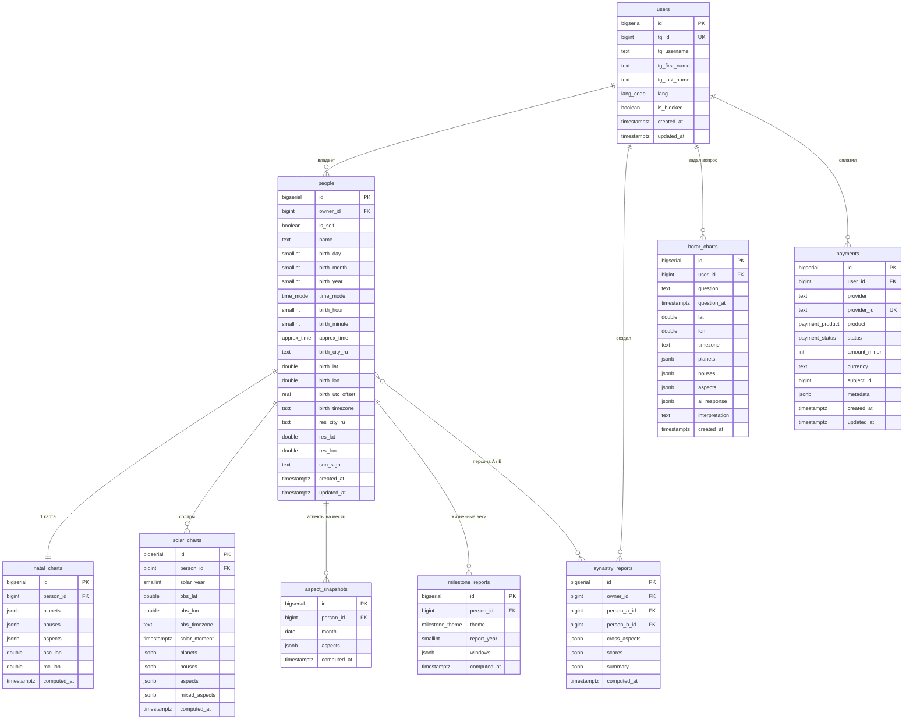

# AstroBot

Telegram Mini App — астрологический бот с натальными картами, синастрией, соляром, жизненными вехами и хораром.

---

## Стек

| Слой | Технология |
|---|---|
| Mini App (фронтенд) | React + Telegram WebApp SDK |
| Бот | grammY (Node.js / TypeScript) |
| Бэкенд API | Fastify (Node.js / TypeScript) |
| Расчёты | Astronomy Engine |
| Геокодинг | Nominatim API |
| База данных | PostgreSQL |
| Платежи (позже) | ЮКасса + Telegram Stars |
| Инфраструктура | VPS (РФ) |

---

## База данных

### Схема файлов

```
db/
├── migrations/
│   └── 001_initial_schema.sql   # полная схема: таблицы, индексы, триггеры
└── seeds/
    └── 001_dev_seed.sql         # тестовые данные для разработки
```

### ENUM-типы

| Тип | Значения | Назначение |
|---|---|---|
| `lang_code` | `ru`, `en` | Язык интерфейса пользователя |
| `time_mode` | `exact`, `approx`, `unknown` | Точность времени рождения |
| `approx_time` | `morning`, `day`, `evening`, `night` | Приблизительное время суток рождения |
| `milestone_theme` | `marriage`, `divorce`, `child`, `career`, `relocation`, `health`, `surgery`, `travel`, `change`, `key` | Тематика жизненной вехи |
| `payment_status` | `pending`, `succeeded`, `cancelled`, `refunded` | Статус платежа |
| `payment_product` | `natal_full`, `synastry`, `solar`, `milestones`, `horar`, `subscription` | Платный продукт |

---

### Таблицы

#### `users` — Пользователи

Хранит всех пользователей, запустивших бота в Telegram. Запись создаётся при первом обращении к боту.

| Столбец | Тип | NULL | По умолчанию | Ограничения | Описание |
|---|---|---|---|---|---|
| `id` | `BIGSERIAL` | NO | auto | PRIMARY KEY | Внутренний идентификатор |
| `tg_id` | `BIGINT` | NO | — | UNIQUE | Telegram user ID (неизменяемый, выдаётся Telegram) |
| `tg_username` | `TEXT` | YES | — | — | Юзернейм в Telegram (`@username`), может меняться или отсутствовать |
| `tg_first_name` | `TEXT` | YES | — | — | Имя в Telegram |
| `tg_last_name` | `TEXT` | YES | — | — | Фамилия в Telegram |
| `lang` | `lang_code` | NO | `'ru'` | IN (`ru`, `en`) | Язык интерфейса |
| `is_blocked` | `BOOLEAN` | NO | `false` | — | Пользователь заблокировал бота; при `true` бот не отправляет сообщения |
| `onboarding_step` | `TEXT` | YES | — | IN (`name`,`birth_date`,`birth_time`,`city`,`consent`,`done`) | Текущий шаг онбординга в чате с ботом; `null` = не начал |
| `onboarding_completed` | `BOOLEAN` | NO | `false` | — | `true` после успешного прохождения всех шагов |
| `created_at` | `TIMESTAMPTZ` | NO | `now()` | — | Дата первого запуска |
| `updated_at` | `TIMESTAMPTZ` | NO | `now()` | auto-trigger | Дата последнего обновления записи |

**Онбординг-сценарий (шаги):** `name` → `birth_date` → `birth_time` → `city` → `consent` → `done`

**Не может принимать:** `tg_id ≤ 0`, дублирующийся `tg_id`, `lang` вне (`ru`, `en`), `onboarding_step` вне списка значений.

---

#### `people` — Профили рождения

Один пользователь может иметь несколько профилей: **себя** (`is_self = true`, всегда один) и **партнёров** для синастрии (любое количество). Все астрологические расчёты привязаны к записи в этой таблице, а не к пользователю напрямую.

| Столбец | Тип | NULL | По умолчанию | Ограничения | Описание |
|---|---|---|---|---|---|
| `id` | `BIGSERIAL` | NO | auto | PRIMARY KEY | Внутренний идентификатор |
| `owner_id` | `BIGINT` | NO | — | FK → `users.id` CASCADE | Владелец профиля |
| `is_self` | `BOOLEAN` | NO | `false` | UNIQUE (owner_id, is_self=true) | `true` = профиль самого пользователя |
| `name` | `TEXT` | NO | — | — | Имя (на русском) |
| `name_en` | `TEXT` | YES | — | — | Имя (транслитерация) |
| `birth_day` | `SMALLINT` | NO | — | 1–31 | День рождения |
| `birth_month` | `SMALLINT` | NO | — | 1–12 | Месяц рождения |
| `birth_year` | `SMALLINT` | NO | — | 1900–2025 | Год рождения |
| `time_mode` | `time_mode` | NO | `'unknown'` | ENUM | Режим точности времени рождения |
| `birth_hour` | `SMALLINT` | YES | — | 0–23; обязателен если `time_mode='exact'` | Час рождения |
| `birth_minute` | `SMALLINT` | YES | — | 0–59; обязателен если `time_mode='exact'` | Минута рождения |
| `approx_time` | `approx_time` | YES | — | ENUM; обязателен если `time_mode='approx'` | Часть суток рождения |
| `birth_city_ru` | `TEXT` | YES | — | — | Название города рождения (рус.) |
| `birth_city_en` | `TEXT` | YES | — | — | Название города рождения (англ.) |
| `birth_city_reg` | `TEXT` | YES | — | — | Регион / страна |
| `birth_lat` | `DOUBLE PRECISION` | NO | — | -90 – +90 | Широта места рождения |
| `birth_lon` | `DOUBLE PRECISION` | NO | — | -180 – +180 | Долгота места рождения |
| `birth_utc_offset` | `REAL` | NO | — | -12 – +14 | UTC-смещение в момент рождения (дробное: +5.5 для Индии) |
| `birth_timezone` | `TEXT` | NO | — | — | IANA-таймзона места рождения (`Europe/Moscow`) |
| `res_city_ru` | `TEXT` | YES | — | — | Город проживания сейчас (рус.) — для соляра |
| `res_city_en` | `TEXT` | YES | — | — | Город проживания сейчас (англ.) |
| `res_lat` | `DOUBLE PRECISION` | YES | — | -90 – +90 | Широта места проживания |
| `res_lon` | `DOUBLE PRECISION` | YES | — | -180 – +180 | Долгота места проживания |
| `res_timezone` | `TEXT` | YES | — | — | IANA-таймзона места проживания |
| `sun_sign` | `TEXT` | YES | — | — | Знак Солнца (`leo`, `aries` и т.д.), кэшируется при сохранении |
| `birth_date_changed_at` | `TIMESTAMPTZ` | YES | `null` | — | Момент первой смены даты рождения; `null` — не меняли. Если `NOT NULL` и `is_self=true` — повторная смена запрещена |
| `created_at` | `TIMESTAMPTZ` | NO | `now()` | — | Дата создания профиля |
| `updated_at` | `TIMESTAMPTZ` | NO | `now()` | auto-trigger | Дата последнего изменения |

**Бизнес-правила:**

| Поле | Кто может менять | Сколько раз |
|---|---|---|
| `name` | Сам пользователь | Без ограничений |
| `time_mode`, `birth_hour`, `birth_minute`, `approx_time` | Сам пользователь | Без ограничений |
| `birth_day/month/year` | Сам пользователь (только `is_self=true`) | **Один раз за всё время** (защита от переиспользования натальной карты) |
| Любые поля | Партнёрские профили (`is_self=false`) | Без ограничений |

**Составные ограничения:**

| Constraint | Правило |
|---|---|
| `uq_one_self_per_user` | Partial unique index на `owner_id WHERE is_self=true` — у одного пользователя ровно один профиль «себя», партнёров без ограничений |
| `chk_exact_time` | Если `time_mode='exact'` → `birth_hour IS NOT NULL AND birth_minute IS NOT NULL` |
| `chk_approx_time` | Если `time_mode='approx'` → `approx_time IS NOT NULL` |

**Не может принимать:** `birth_day > 31`, `birth_month > 12`, `birth_year < 1900`, `birth_lat > 90`, `birth_lon > 180`, `birth_utc_offset > 14`, `time_mode='exact'` без `birth_hour`/`birth_minute`.

**Триггер `trg_invalidate_cache_on_birth_change`:**
- При изменении birth-полей → удаляет `natal_charts`, `synastry_reports`, `aspect_snapshots`, `milestone_reports`
- При изменении `res_lat`/`res_lon` → удаляет только `solar_charts` (место жительства влияет только на соляр)

---

#### `legal_consents` — Юридические согласия

Хранит факт принятия каждого юридического документа каждым пользователем. Запись создаётся в момент онбординга (шаг `consent`). Повторное принятие той же версии идемпотентно — возвращается существующая запись без дублирования.

| Столбец | Тип | NULL | По умолчанию | Ограничения | Описание |
|---|---|---|---|---|---|
| `id` | `BIGSERIAL` | NO | auto | PRIMARY KEY | — |
| `user_id` | `BIGINT` | NO | — | FK → `users.id` CASCADE | Пользователь |
| `document_type` | `TEXT` | NO | — | IN (`privacy_policy`, `terms_of_service`) | Тип документа |
| `document_version` | `TEXT` | NO | — | — | Версия документа (`'1.0'`, `'2025-06'`) |
| `accepted_at` | `TIMESTAMPTZ` | NO | `now()` | — | Момент принятия |
| `tg_client` | `TEXT` | YES | — | — | Telegram-клиент пользователя (из initData) |
| `ip_address` | `INET` | YES | — | — | IP бэкенда/бота в момент приёма запроса |

**Составное уникальное ограничение:** `(user_id, document_type, document_version)` — нельзя принять одну версию дважды.

**Не может принимать:** `document_type` вне (`privacy_policy`, `terms_of_service`), пустой `document_version`.

---

#### `natal_charts` — Натальная карта (кэш)

Кэш результата расчёта натальной карты для профиля. Одна запись на профиль. Пересчитывается автоматически при изменении данных рождения (через триггер на `people`). Хранит данные в JSONB, так как структура планет и аспектов нефиксированна.

| Столбец | Тип | NULL | По умолчанию | Ограничения | Описание |
|---|---|---|---|---|---|
| `id` | `BIGSERIAL` | NO | auto | PRIMARY KEY | — |
| `person_id` | `BIGINT` | NO | — | FK → `people.id` CASCADE, UNIQUE | Профиль рождения |
| `planets` | `JSONB` | NO | — | — | Позиции планет: `{ sun: { lon, sign_idx, house, retrograde }, moon: {...}, ... }` |
| `houses` | `JSONB` | YES | — | — | Куспиды домов: `{ "1": lon, "2": lon, ... }` — `null` если `time_mode='unknown'` |
| `aspects` | `JSONB` | NO | — | — | Аспекты между планетами: `[{ p1, p2, type, angle, orb, applying }]` |
| `asc_lon` | `DOUBLE PRECISION` | YES | — | — | Эклиптическая долгота Асцендента — `null` если время неизвестно |
| `mc_lon` | `DOUBLE PRECISION` | YES | — | — | Эклиптическая долгота МС — `null` если время неизвестно |
| `computed_at` | `TIMESTAMPTZ` | NO | `now()` | — | Момент расчёта |

**Не может принимать:** два ряда с одним `person_id` (UNIQUE).

---

#### `solar_charts` — Соляр (кэш)

Кэш расчёта солярной (юбилейной) карты. Создаётся для каждой комбинации **профиль + год + место наблюдения**, потому что место проживания в момент соляра влияет на расчёт. Смешанные аспекты между соляром и натальной картой хранятся отдельно в `mixed_aspects`.

| Столбец | Тип | NULL | По умолчанию | Ограничения | Описание |
|---|---|---|---|---|---|
| `id` | `BIGSERIAL` | NO | auto | PRIMARY KEY | — |
| `person_id` | `BIGINT` | NO | — | FK → `people.id` CASCADE | Профиль рождения |
| `solar_year` | `SMALLINT` | NO | — | — | Год соляра (год возврата Солнца) |
| `obs_lat` | `DOUBLE PRECISION` | NO | — | — | Широта места наблюдения |
| `obs_lon` | `DOUBLE PRECISION` | NO | — | — | Долгота места наблюдения |
| `obs_city_ru` | `TEXT` | YES | — | — | Название города наблюдения (рус.) |
| `obs_city_en` | `TEXT` | YES | — | — | Название города наблюдения (англ.) |
| `obs_timezone` | `TEXT` | NO | — | — | IANA-таймзона места наблюдения |
| `solar_moment` | `TIMESTAMPTZ` | NO | — | — | Точный момент возврата Солнца (UTC) |
| `planets` | `JSONB` | NO | — | — | Позиции планет солярной карты |
| `houses` | `JSONB` | YES | — | — | Куспиды домов соляра |
| `aspects` | `JSONB` | NO | — | — | Аспекты внутри солярной карты |
| `asc_lon` | `DOUBLE PRECISION` | YES | — | — | Асцендент соляра |
| `mc_lon` | `DOUBLE PRECISION` | YES | — | — | МС соляра |
| `mixed_aspects` | `JSONB` | YES | — | — | Аспекты «планеты соляра → планеты натала» |
| `computed_at` | `TIMESTAMPTZ` | NO | `now()` | — | Момент расчёта |

**Составное уникальное ограничение:** `(person_id, solar_year, obs_lat, obs_lon)` — не может быть двух одинаковых расчётов для одной точки.

---

#### `synastry_reports` — Синастрия (кэш)

Кэш расчёта совместимости двух профилей. Кросс-аспекты (аспекты между планетами персоны A и персоны B) и итоговые баллы по четырём измерениям хранятся в JSONB.

| Столбец | Тип | NULL | По умолчанию | Ограничения | Описание |
|---|---|---|---|---|---|
| `id` | `BIGSERIAL` | NO | auto | PRIMARY KEY | — |
| `owner_id` | `BIGINT` | NO | — | FK → `users.id` CASCADE | Пользователь, создавший отчёт |
| `person_a_id` | `BIGINT` | NO | — | FK → `people.id` CASCADE | Персона A |
| `person_b_id` | `BIGINT` | NO | — | FK → `people.id` CASCADE | Персона B |
| `cross_aspects` | `JSONB` | NO | — | — | Кросс-аспекты: `[{ pa, pb, type, angle, orb, domain, tone }]` |
| `scores` | `JSONB` | NO | — | — | Баллы: `{ total, attraction, emotion, communication, stability }` |
| `summary` | `JSONB` | YES | — | — | Итог: `{ theme, positive_count, tension_count }` |
| `computed_at` | `TIMESTAMPTZ` | NO | `now()` | — | Момент расчёта |

**Ограничения:**

| Constraint | Правило |
|---|---|
| `uq_synastry_pair` | `(person_a_id, person_b_id)` уникальны — нельзя дважды сохранить одну пару |
| `chk_synastry_different` | `person_a_id <> person_b_id` — нельзя сравнивать профиль сам с собой |

**Не может принимать:** `person_a_id = person_b_id`, дублирующуюся пару.

---

#### `aspect_snapshots` — Аспекты на месяц (кэш)

Кэш транзитных аспектов для профиля на конкретный месяц. Используется в разделе «Аспекты на месяц» главного экрана.

| Столбец | Тип | NULL | По умолчанию | Ограничения | Описание |
|---|---|---|---|---|---|
| `id` | `BIGSERIAL` | NO | auto | PRIMARY KEY | — |
| `person_id` | `BIGINT` | NO | — | FK → `people.id` CASCADE | Профиль рождения |
| `month` | `DATE` | NO | — | `DAY = 1`; UNIQUE с `person_id` | Первый день месяца (`2025-07-01`) |
| `aspects` | `JSONB` | NO | — | — | Список аспектов: `[{ planet, transit_planet, type, date_start, date_exact, date_end, interpretation_key }]` |
| `computed_at` | `TIMESTAMPTZ` | NO | `now()` | — | Момент расчёта |

**Не может принимать:** `month` с `DAY ≠ 1` (например `2025-07-15`), дублирующуюся пару `(person_id, month)`.

---

#### `milestone_reports` — Жизненные вехи (кэш)

Кэш расчёта жизненных окон по конкретной теме и году. Тема определяет, какие планеты и куспиды анализируются (сигнификаторы). Окна рассчитываются как периоды активных транзитов медленных планет к сигнификаторам темы.

| Столбец | Тип | NULL | По умолчанию | Ограничения | Описание |
|---|---|---|---|---|---|
| `id` | `BIGSERIAL` | NO | auto | PRIMARY KEY | — |
| `person_id` | `BIGINT` | NO | — | FK → `people.id` CASCADE | Профиль рождения |
| `theme` | `milestone_theme` | NO | — | ENUM | Тема вехи |
| `report_year` | `SMALLINT` | NO | — | — | Год, для которого строился отчёт |
| `windows` | `JSONB` | NO | — | — | Окна событий: `[{ start, end, score, polarity, bucket, aspects: [{ transiter, target, type, sym }], tone: { label, color } }]` |
| `computed_at` | `TIMESTAMPTZ` | NO | `now()` | — | Момент расчёта |

**Составное уникальное ограничение:** `(person_id, theme, report_year)` — одна запись на тему + год.

---

#### `horar_charts` — Хорарные карты *(позже)*

Карта момента задачи вопроса пользователем. Для хорарной астрологии важна точная дата, время и место формулировки вопроса. Интерпретация генерируется ИИ.

| Столбец | Тип | NULL | По умолчанию | Ограничения | Описание |
|---|---|---|---|---|---|
| `id` | `BIGSERIAL` | NO | auto | PRIMARY KEY | — |
| `user_id` | `BIGINT` | NO | — | FK → `users.id` CASCADE | Пользователь |
| `question` | `TEXT` | NO | — | — | Текст вопроса |
| `question_at` | `TIMESTAMPTZ` | NO | — | — | Момент вопроса (UTC) |
| `lat` | `DOUBLE PRECISION` | NO | — | — | Широта места вопроса |
| `lon` | `DOUBLE PRECISION` | NO | — | — | Долгота места вопроса |
| `timezone` | `TEXT` | NO | — | — | IANA-таймзона места вопроса |
| `city_name` | `TEXT` | YES | — | — | Название города вопроса |
| `planets` | `JSONB` | YES | — | — | Позиции планет хорарной карты |
| `houses` | `JSONB` | YES | — | — | Куспиды домов хорарной карты |
| `aspects` | `JSONB` | YES | — | — | Аспекты хорарной карты |
| `ai_response` | `JSONB` | YES | — | — | Сырой ответ ИИ (для аудита и переинтерпретации) |
| `interpretation` | `TEXT` | YES | — | — | Итоговый текст интерпретации |
| `created_at` | `TIMESTAMPTZ` | NO | `now()` | — | Дата сохранения |

---

#### `payments` — Платежи *(позже)*

Все платёжные транзакции. Поддерживает два провайдера: ЮКасса (рубли) и Telegram Stars. Сумма хранится в минимальных единицах: копейках для рублей, целых звёздах для XTR. При удалении пользователя платежи не удаляются (`ON DELETE RESTRICT`) — это требование финансового учёта.

| Столбец | Тип | NULL | По умолчанию | Ограничения | Описание |
|---|---|---|---|---|---|
| `id` | `BIGSERIAL` | NO | auto | PRIMARY KEY | — |
| `user_id` | `BIGINT` | NO | — | FK → `users.id` **RESTRICT** | Плательщик |
| `provider` | `TEXT` | NO | `'yookassa'` | — | Провайдер: `yookassa` или `telegram_stars` |
| `provider_id` | `TEXT` | YES | — | UNIQUE | ID транзакции у провайдера |
| `product` | `payment_product` | NO | — | ENUM | Оплаченный продукт |
| `status` | `payment_status` | NO | `'pending'` | ENUM | Статус платежа |
| `amount_minor` | `INT` | NO | — | `> 0` | Сумма в минимальных единицах (копейки / звёзды) |
| `currency` | `TEXT` | NO | `'RUB'` | — | Валюта: `RUB` или `XTR` (Telegram Stars) |
| `subject_id` | `BIGINT` | YES | — | — | ID связанного объекта (например, `people.id`) |
| `metadata` | `JSONB` | YES | — | — | Дополнительные данные от провайдера |
| `created_at` | `TIMESTAMPTZ` | NO | `now()` | — | Дата создания транзакции |
| `updated_at` | `TIMESTAMPTZ` | NO | `now()` | auto-trigger | Дата последнего изменения статуса |

**Не может принимать:** `amount_minor ≤ 0`, `status` вне ENUM, `product` вне ENUM.

---

### ER-диаграмма



---

### Индексы

| Индекс | Таблица | Столбцы | Тип | Причина |
|---|---|---|---|---|
| `idx_users_tg_id` | `users` | `tg_id` | B-tree | Поиск пользователя по Telegram ID при каждом сообщении боту |
| `idx_people_owner` | `people` | `owner_id` | B-tree | Получение всех профилей пользователя |
| `idx_people_owner_self` | `people` | `owner_id` WHERE `is_self=true` | Partial | Быстрый доступ к «своему» профилю |
| `idx_natal_person` | `natal_charts` | `person_id` | B-tree | Проверка наличия кэша натала |
| `idx_solar_person_year` | `solar_charts` | `(person_id, solar_year)` | B-tree | Поиск соляра для профиля и года |
| `idx_synastry_owner` | `synastry_reports` | `owner_id` | B-tree | Список синастрий пользователя |
| `idx_synastry_a` / `_b` | `synastry_reports` | `person_a_id`, `person_b_id` | B-tree | Инвалидация кэша при изменении профиля |
| `idx_aspects_person_month` | `aspect_snapshots` | `(person_id, month)` | B-tree | Проверка наличия снимка на конкретный месяц |
| `idx_milestones_person` | `milestone_reports` | `person_id` | B-tree | Список отчётов по вехам |
| `idx_horar_user` | `horar_charts` | `user_id` | B-tree | История хораров пользователя |
| `idx_payments_user` | `payments` | `user_id` | B-tree | История платежей |
| `idx_payments_status` | `payments` | `status` WHERE `='pending'` | Partial | Обработка незавершённых платежей |

---

### Триггеры

| Триггер | Таблица | Событие | Функция | Что делает |
|---|---|---|---|---|
| `trg_users_updated_at` | `users` | BEFORE UPDATE | `set_updated_at()` | Проставляет `updated_at = now()` |
| `trg_people_updated_at` | `people` | BEFORE UPDATE | `set_updated_at()` | Проставляет `updated_at = now()` |
| `trg_payments_updated_at` | `payments` | BEFORE UPDATE | `set_updated_at()` | Проставляет `updated_at = now()` |
| `trg_invalidate_cache_on_birth_change` | `people` | AFTER UPDATE | `invalidate_chart_cache()` | При изменении birth-полей удаляет кэши натала/синастрии/аспектов/вех; при изменении res_lat/lon — только кэш соляра |

---

## Бэкенд API

### Структура проекта

```
backend/
├── src/
│   ├── index.ts              # точка входа, graceful shutdown
│   ├── app.ts                # Fastify instance + регистрация плагинов и роутов
│   ├── config.ts             # типизированный env-конфиг
│   ├── types.ts              # общие типы: DB rows, auth context, enums
│   ├── db/
│   │   ├── pool.ts           # pg.Pool
│   │   └── queries/
│   │       ├── users.ts      # upsertUser, getUserByTgId, setOnboardingStep…
│   │       ├── people.ts     # createPerson, updatePerson (с правилом даты)…
│   │       └── consents.ts   # saveConsent, hasConsent…
│   ├── plugins/
│   │   └── auth.ts           # аутентификация: Telegram initData + Bot Secret
│   └── routes/
│       ├── users.ts          # /api/users/*
│       ├── people.ts         # /api/users/:tgId/self, /api/people/*
│       └── charts.ts         # /api/people/:personId/natal|solar|aspects|milestones
├── package.json
├── tsconfig.json
└── .env.example
```

### Аутентификация

Все запросы к `/api/*` требуют одного из двух заголовков:

| Заголовок | Формат | Кто использует |
|---|---|---|
| `Authorization` | `tma <initData>` | Telegram Mini App (HMAC-SHA256 по bot token) |
| `X-Bot-Secret` | `<secret>` | grammY-бот при внутренних вызовах |

Эндпойнт `/health` открыт без авторизации.

### Эндпойнты

#### Пользователи (`/api/users`)

| Метод | Путь | Описание |
|---|---|---|
| `POST` | `/users/upsert` | Создать или обновить пользователя по `tg_id` (при каждом `/start`) |
| `GET` | `/users/:tgId` | Получить пользователя |
| `PATCH` | `/users/:tgId/onboarding-step` | Обновить текущий шаг онбординга |
| `PATCH` | `/users/:tgId/lang` | Сменить язык интерфейса |
| `PATCH` | `/users/:tgId/blocked` | Пометить как заблокировавшего бота |
| `POST` | `/users/:tgId/consents` | Сохранить согласие с документом (идемпотентно) |
| `GET` | `/users/:tgId/consents` | Список принятых согласий |

#### Профили рождения (`/api/people`)

| Метод | Путь | Описание |
|---|---|---|
| `POST` | `/users/:tgId/self` | Создать self-профиль (онбординг) |
| `GET` | `/users/:tgId/self` | Получить self-профиль |
| `PATCH` | `/users/:tgId/self` | Обновить self-профиль (дата — только 1 раз) |
| `GET` | `/users/:tgId/people` | Список всех профилей (себя + партнёры) |
| `POST` | `/users/:tgId/people` | Добавить партнёра для синастрии |
| `PATCH` | `/people/:personId` | Обновить любой профиль по внутреннему ID |
| `DELETE` | `/people/:personId` | Удалить партнёра (self удалить нельзя → 403) |

#### Расчёты (`/api/charts`) — реализуются позже

| Метод | Путь | Описание |
|---|---|---|
| `GET` | `/people/:personId/natal` | Натальная карта (кэш или вычислить) |
| `GET` | `/people/:personId/solar?year=YYYY` | Соляр |
| `GET` | `/people/:personId/aspects?month=YYYY-MM` | Аспекты на месяц |
| `GET` | `/people/:personId/milestones?theme=X&year=YYYY` | Жизненные вехи |
| `POST` | `/synastry` | Синастрия двух профилей |

### Коды ответов

| Код | Когда |
|---|---|
| `200` | Успех (GET, upsert) |
| `201` | Создан новый ресурс |
| `204` | Успех без тела (PATCH, DELETE) |
| `400` | Ошибка валидации — тело содержит `{ error: ZodFlattenedErrors }` |
| `401` | Отсутствует или неверный заголовок авторизации |
| `403` | Запрещено (напр. удаление self-профиля) |
| `404` | Ресурс не найден |
| `409` | Конфликт: `BIRTH_DATE_LOCKED` — дата рождения уже была изменена |
| `501` | Расчёт ещё не реализован |

### Запуск

```bash
cd backend
cp .env.example .env   # заполнить переменные
npm install
npm run dev            # tsx watch — hot reload
```
